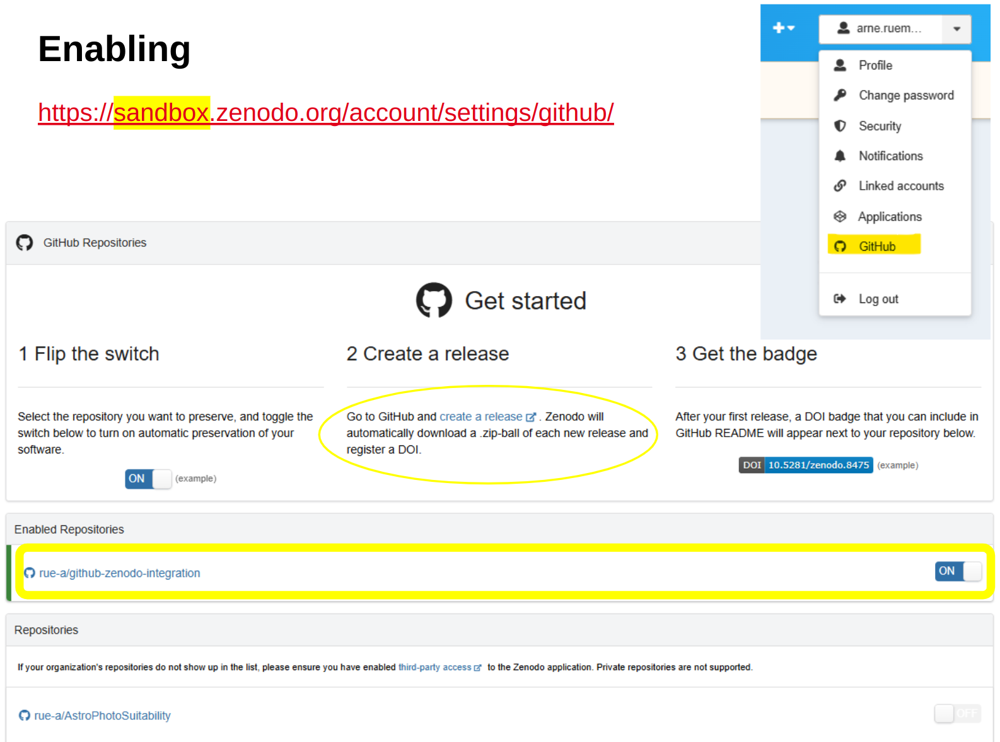

# Zenodo-GitHub -Integration

*When the Zenodo-GitHub-Integration is enabled, each new repository release triggers Zenodo to archive it and assign a DOI, thus ensuring proper citation and long-term accessibility. This document details which metadata is extracted from the GitHub repository and transferred to Zenodo.*

## Configuring the Zenodo-GitHub-Integration

Configuring the Zenodo-GitHub-Integration is a straightforward process. To enable it, navigate to the Zenodo settings page and link your GitHub account to your Zenodo account. Then, locate the repository of interest and activate the integration by toggling the corresponding switch. Once enabled, the next release of the repository will automatically generate a Zenodo record.

> [!WARNING]
> It is strongly advised to **test the integration on the [Zenodo Sandbox](https://sandbox.zenodo.org/)** before deploying it in a production environment; once a record is published on Zenodo, it cannot be deleted.

## Effects of the Integration 

As soon as a connection between a GitHub repository and Zenodo is established, each new release on GitHub causes the Zenodo integration software (Zenodo agent) to pull the repository as a compressed ZIP archive and to publish it on Zenodo as a new record or, if a record was already created by a previous release, a new version. The Zenodo agent also extracts metadata from the GitHub repository and uses it to populate the Zenodo record.

Besides metadata that is extracted directly from the repository, the Zenodo agent also searches the root directory of the GitHub repository for certain files from which it can extract metadata for the Zenodo record. Namely, these files are `LICENSE`, `CITATION.cff`, and `.zenodo.json`. Refer to the [ metadata mapping table](https://docs.google.com/spreadsheets/d/14XAITKJBJQ8JJBGAX_rkhZtm3W_4EjkQBwkY5Up6xEk/edit?usp=sharing) for details.

> [!NOTE]
> Information in the `.zenodo.json` file takes priority over data in `CITATION.cff`, which in turn overrides details in the `LICENSE` file. Finally, any remaining information from the GitHub repository is used as the lowest priority source. 

> [!WARNING]
> If both a Zenodo metadata file and a citation metadata file are present in the GitHub repository, [the citation metadata file is completely ignored by the Zenodo agent](https://support.zenodo.org/help/en-gb/24-github-integration/96-how-does-a-citation-cff-file-affect-metadata-of-my-github-release).

### Recommendations

- Use a metadata file (`CITATION.cff` or `.zenodo.json`).
  
- Do not include license information in the metadata file, but let the
Zenodo agent interpret the `LICENSE` file itself.

- Handle the version management via the GitHub release tags.
 
- When using the Zenodo metadata file, only enter
information that is consistent over multiple releases.

## Metadata File References

### `LICENSE`

If a license file is found in the repository, the Zenodo agent reads the file and generates a corresponding metadata entry for the Zenodo record, thereby overwriting the default license (CC-BY-4.0). Although, the Zenodo metadata schema supports multi-licensing, if more than one license is found in the GitHub repository, only one of them is used for the metadata of the Zenodo record (whichever comes first alphabetically).

> [!NOTE] 
> If the license text is erroneous, the process fails and nothing is published on Zenodo. Ideally, use the [GitHub license templates](https://docs.github.com/en/communities/setting-up-your-project-for-healthy-contributions/adding-a-license-to-a-repository) to generate the license text.

License information in the `CITATION.cff` fiel or `.zenodo.json` file cause the Zenodo agent to ignore any license file present in the repository.

### `CITATION.cff`

“`CITATION.cff` files are plain text files with human- and machine-readable citation information for software (and datasets). Code developers can include them in their repositories to let others know how to correctly cite their software” ([Citation File Format](https://citation-file-format.github.io/)).

As it is considered good scientific practice to include such a citation metadata file in Git repositories, Zenodo started supporting it in 2023.

If a citation metadata file is found in the root directory of the GitHub repository, the Zenodo agent fetches its contents and fills the metadata fields of the Zenodo record accordingly, thereby overwriting the [fetched metadata](#subsec:fetched_metadata). Only a subset of the citation metadata is mapped to Zenodo metadata, e.g., the version or the release date are ignored.

> [!NOTE]
>  If the citation metadata file is structurally invalid or contains invalid values, the process fails and nothing is published on Zenodo. Ideally, use the [CFF INIT tool](https://citation-file-format.github.io/cff-initializer-javascript/#/) to create valid citation metadata files.

### `.zenodo.json`

The Zenodo metadata file is similar to the citation metadata file, but with the explicit and sole function of providing predefined metadata for the Zenodo record to the Zenodo agent. As such, it allows defining each metadata field of the resulting Zenodo record. Details can be found on the [Zenodo developers page](https://developers.zenodo.org/#add-metadata-to-your-github-repository-release).

> [!NOTE]
> Every information defined in the Zenodo metadata file is transmitted to the resulting Zenodo record as is. This means, for example, not changing the version value in the Zenodo metadata file across multiple releases results in multiple Zenodo record versions with the same version label.
> 

> [!NOTE]
> If the Zenodo metadata file is structurally invalid or contains invalid values, the process fails and nothing is published on Zenodo. Ideally, validate your Zenodo metadata file against the [Zenodo record legacy schema](https://github.com/zenodo/zenodo/blob/master/zenodo/modules/deposit/jsonschemas/deposits/records/legacyrecord.json). To do this, e.g., go to [JSON Schema Validator](https://www.jsonschemavalidator.net/), paste the schema in the left box, and your Zenodo metadata file in the right box.

## Limitations

It is not possible to link a GitHub repository with an existing Zenodo record. Populating the `doi` field in the [Zenodo Metadata File](#subsec:zenodo-json) has no effect. It is also [impossible to reserve a DOI for a GitHub release](https://support.zenodo.org/help/en-gb/24-github-integration/73-can-i-pre-reserved-a-doi-before-a-github-release) or to get informed about the DOI before it is being minted upon the GitHub release.
